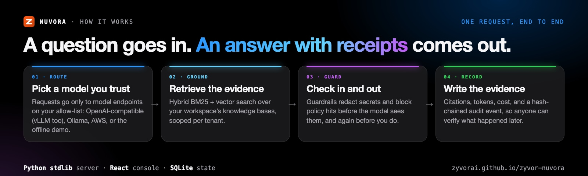
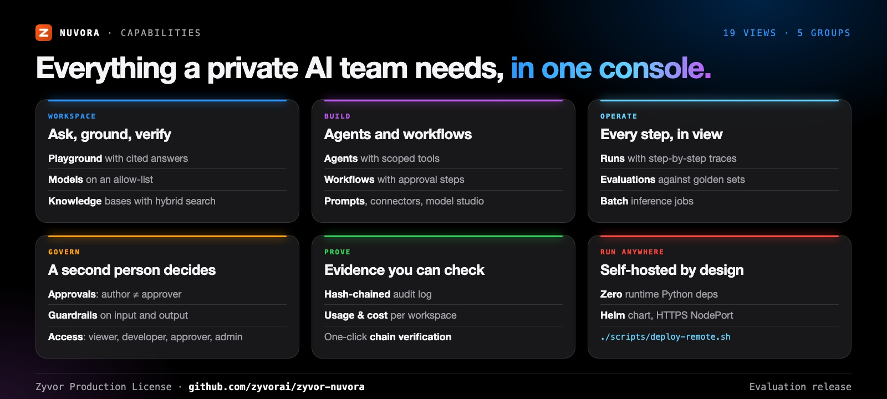
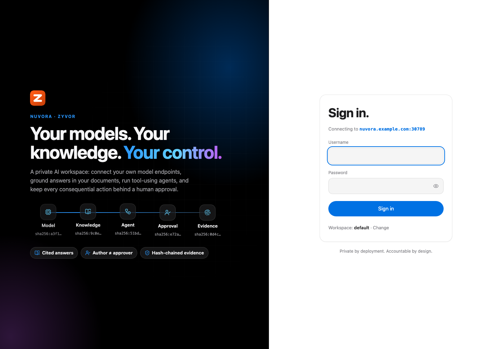
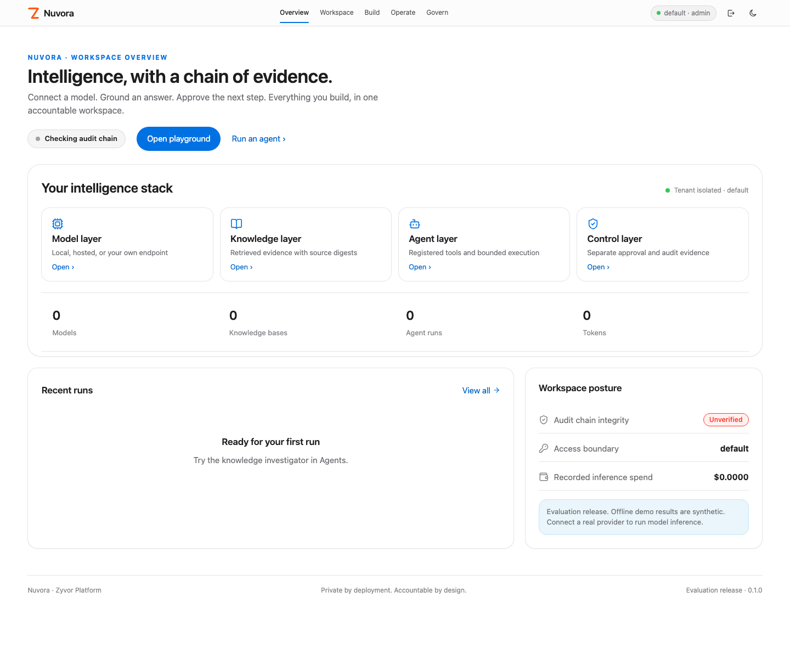
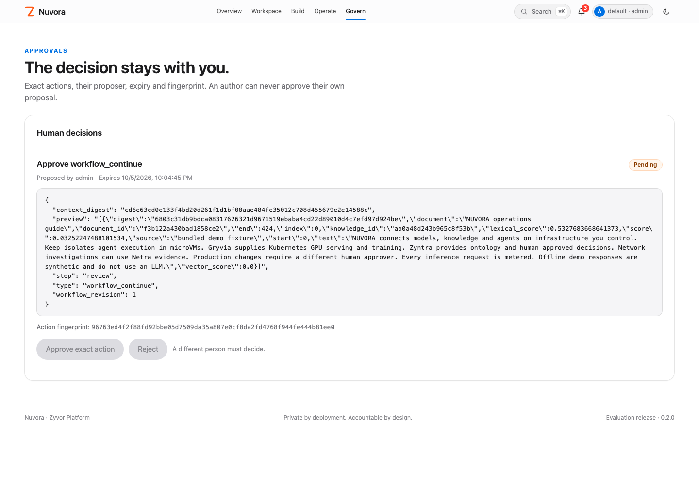
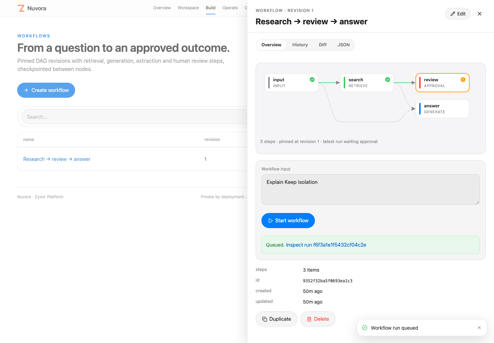

<div align="center">

# Nuvora

[](https://github.com/zyvorai/zyvor-nuvora/actions/workflows/ci.yml)
[](LICENSE)
[](CHANGELOG.md)
[](pyproject.toml)
[](web)
[](https://zyvorai.github.io/zyvor-nuvora/)


### Private AI that shows its work.

**A self-hosted AI application platform.** Connect your own model endpoints, ground every answer in cited evidence, run tool-using agents and reviewed workflows, and keep each consequential action behind a different human's approval.

**19 console views** · **4 model adapters** · **Tenant-scoped** · **Author ≠ approver** · **Hash-chained evidence** · **Zero required Python deps**

📖 **[Read the full docs](https://zyvorai.github.io/zyvor-nuvora/)**: quickstart, concepts, security model, and a product tour.

</div>

---

> **0.2.0 is an evaluation release. It is not managed-platform parity and not a production certification.**
> - Model invocation works against configured OpenAI-compatible or Ollama endpoints.
> - An optional boto3 adapter supports AWS-hosted models (Converse and streaming), without tools.
> - The bundled offline model is explicitly synthetic.
> - SSO, PostgreSQL with several replicas, and the Netra/Zyntra/Keep integrations are new and tested against stubs, not yet against every IdP or production install.
> - GPU training, managed model hosting, multi-region HA, and classifier-based guardrails are not implemented.
>
> Check the [capability matrix](docs/CAPABILITIES.md) before relying on any feature.

## What's new

From [CHANGELOG.md](CHANGELOG.md):

| | |
|---|---|
| **Single sign-on** | OIDC code flow with PKCE, bearer JWTs, just-in-time users and group-to-role mapping. [SSO →](https://zyvorai.github.io/zyvor-nuvora/docs/operate/sso) |
| **PostgreSQL and replicas** | `NUVORA_DATABASE_URL` switches storage. Jobs are leased across workers, and the audit chain stays linear. Includes a SQLite migration script. [Postgres →](https://zyvorai.github.io/zyvor-nuvora/docs/operate/postgres) |
| **Platform integrations** | Fabric/Gryvia presets with model discovery, Netra evidence tools, Zyntra handoff steps, and Keep sandboxed code with approval. [Integrations →](https://zyvorai.github.io/zyvor-nuvora/docs/operate/integrations) |
| **Documents and evaluations** | Upload PDF, DOCX, HTML, CSV and more. Evaluations add LLM-judge and grounded cases, plus a case editor with per-case reasons. Live `/v1` streaming. |
| **One-command k3s deploy** | `./scripts/deploy-remote.sh HOST USER` builds on the host, imports into k3s, serves HTTPS on NodePort 30789, and generates the admin password. [Docs →](docs/deploy.md) |

---

## Why Nuvora

| When this happens… | Nuvora gives you… |
|---|---|
| You can't send prompts or documents to a hosted AI vendor | Your own endpoints only (vLLM, Ollama, OpenAI-compatible, AWS), on an exact host allow-list |
| Answers sound right, but nobody can say where they came from | Hybrid BM25 + vector retrieval with cited passages and content digests on every answer |
| An agent wants to send, write, or spend | The step pauses, and a different person approves the exact action, fingerprint included |
| Audit asks what happened six weeks ago | A hash-chained audit log you can export and verify offline |
| Teams share one platform but not one data set | Tenant-scoped storage, four roles, and scoped service tokens |
| Finance asks what AI costs | A usage and cost ledger per workspace, with token budgets and concurrency caps |





## Quickstart

The API and the included compiled console need only Python **3.11+**. The offline demo doesn't need a GPU, a cluster, `pip install`, or a hosted model.

```bash
export NUVORA_ADMIN_PASSWORD='choose-your-own-strong-password'
python3 -m nuvora.server --demo
```

Open **http://127.0.0.1:8789** and sign in as `admin` with the password from your environment, in workspace `default`.
- The first start creates the administrator. Changing the variable later doesn't reset the password.
- There's no built-in default password locally. The 12-character minimum is relaxed only for the deploy script's demo password (see below).

The demo seeds:
- a synthetic model and a knowledge base
- an investigator agent and an approval workflow
- a prompt, an evaluation suite, and an external-training recipe

1. Open **Playground**, choose *Zyvor field guide*, and ask about Keep.
2. Inspect the retrieved passages and content digests. The demo response is labeled **OFFLINE DEMO**.
3. Open **Agents**, select the investigator, and queue a run. Inspect its tool trace in **Runs**.
4. Open **Workflows**, start *Research → review → answer*, and inspect its waiting approval.
5. In **Access**, add a separate person with the `approver` role. Sign in as that person and approve the exact action.
6. The worker resumes the pinned workflow revision. Export the completed run evidence.

## Deploy to k3s

The same pattern Netra uses: rsync the tree, build on the host with podman, import into k3s, and run `helm upgrade --install` with a persistent TLS secret.

```bash
./scripts/deploy-remote.sh 10.0.1.5 ubuntu      # HOST USER, or user@host
```

The script prints the result when it finishes:
- **URL:** `https://HOST:30789`, using a self-signed certificate that persists across redeploys.
- **Sign in:** `admin`, with the password the script generates and prints on the first deploy. Set `NUVORA_ADMIN_PASSWORD` to choose one, or `NUVORA_DEMO_PASSWORD=1` for the lab login `Admin@321`.

Flags:
- `--quick` skips the image build.
- `--verify-only` checks health without changing anything.
- `--dry-run` shows the plan.

Environment variables include `NUVORA_NODE_PORT`, `NUVORA_PROVIDER_HOSTS`, and `NUVORA_DEMO=0`. See [docs/deploy.md](docs/deploy.md) for the full list.

## Tour

| | |
|---|---|
|  |  |
| **Sign in.** A split-screen hero, with the server named on the card. | **Overview.** Onboarding, your intelligence stack, live charts and recent runs. |
|  |  |
| **Playground.** Conversations, streaming, model compare and cited passages. | **Knowledge.** Bases, documents, and content digests. |
|  |  |
| **Runs.** Every step, in view. | **Approvals.** The exact action, proposer, expiry, and fingerprint. |
|  |  |
| **⌘K.** Jump to any page, resource or action, or just ask. | **Workflows.** Every resource opens in a drawer; workflows draw their DAG. |
|  |  |
| **Builder.** Add, wire and reorder steps visually, or edit the JSON. | **Usage.** Requests, tokens, cost and latency over time, against the budget. |
|  |  |
| **Evidence.** A verifiable hash chain. | **Dark mode.** One click, remembered on this device. |


## Connect a real model

```bash
export NUVORA_PROVIDER_HOSTS='localhost,127.0.0.1,inference.internal.example'
export NUVORA_SECRET_VLLM='your-provider-key'
python3 -m nuvora.server
```

In **Models**, create an `openai` provider with the base URL of your OpenAI-compatible endpoint (vLLM, llama.cpp, Fabric, or Gryvia).
- Loopback HTTP is accepted. Remote hosts require HTTPS and must be on the exact operator allow-list.
- Credentials reference a `NUVORA_SECRET_*` environment variable. Credential values are never saved in model objects.

Choose the provider explicitly in Playground, or use `auto`:
- `auto` picks the lowest configured input-plus-output price among the real chat providers that are enabled.
- It falls back to the demo only when no real provider exists.
- This is price-based selection, not a quality-aware router.

For a local Ollama native adapter, choose `ollama` with base URL `http://127.0.0.1:11434`. For tool-using agents with Ollama, use its OpenAI-compatible `/v1` endpoint with provider `openai`.

Optional AWS access: run `python3 -m pip install '.[aws]'`, then create an `aws` model with a region and an enabled model or inference-profile identifier.
- boto3 uses the standard AWS credential chain.
- This path hasn't been validated against a live AWS account.

## What is included

| Area | Runnable behavior |
|---|---|
| Models | Catalog, explicit or price-based routing, OpenAI/Ollama adapters, optional AWS adapter |
| Knowledge | File upload (txt/md/json/csv/html/docx, PDF via extra), chunking, content hashes, BM25 + lexical-vector fusion, OpenAI/Ollama embeddings, optional LLM rerank |
| Agents | Bounded model/tool loop, registered tool schemas, read tools, Netra evidence tools, Keep `run_code` behind approval, session memory, human-approved memory writes |
| Connectors & actions | Typed admin-registered enterprise APIs; external writes wait for independent exact-argument approval |
| Workflows | Ordered DAG validation, retrieve/generate/template/condition/extract/review/handoff nodes, durable checkpoints, Zyntra handoff |
| Prompts | Variable validation, optimistic revision edits, retained version snapshots |
| Evaluation | Contains/excludes, LLM-judge and grounded cases, per-case reasons, scores, release verdicts, comparable-suite regression endpoint |
| Governance | OIDC SSO, tenant isolation, viewer/developer/approver/admin roles, scoped and revocable service tokens, member role management, separate-human approvals |
| Guardrails | Topic patterns, instruction-override patterns, size limits, email/account redaction; applied to inputs/outputs |
| Inference operations | Live guardrail-checked streaming in the console and on `/v1`, deterministic cache, batch jobs, token budgets, concurrency caps |
| Evidence | Job traces, source digests, hash-chained audit with filters, CSV and JSON exports, offline chain verification |
| Console | Command palette, streaming playground with model compare, resource drawers with history and diff, workflow builder, run inspector with inline approval, usage charts |
| Delivery | SQLite or PostgreSQL, compiled console, Python SDK/CLI, Docker/Compose, release images on ghcr.io, Helm chart with replicas, k3s deploy script, GitHub Actions, unit/API/DOM/browser tests |

## Develop and test

```bash
make check                        # backend tests, console tests, console build
```

The console uses React, TypeScript, Vite, and lucide-react on the [Zyvor Apple UX contract](docs/design/APPLE-UX-CONTRACT.md).

To run the browser smoke test, install Playwright first, then point it at a running instance:

```bash
npm install --no-save --package-lock=false playwright && npx playwright install chromium --only-shell
NUVORA_TEST_URL=https://HOST:30789 NUVORA_TEST_PASSWORD='YOUR_ADMIN_PASSWORD' node scripts/browser-smoke.cjs
```

The smoke test signs in, exercises every page and the evaluate-to-runs flow, verifies the evidence chain, and checks light and dark at 1440px and 390px. It writes its screenshots to `docs/ux/`.

The README artwork is rendered from HTML: run `./docs/social/build.sh` (see [docs/social](docs/social/README.md)).

## Documentation

- [Docs site](https://zyvorai.github.io/zyvor-nuvora/)
- [Capabilities](docs/CAPABILITIES.md)
- [Architecture](docs/ARCHITECTURE.md)
- [API](docs/API.md)
- [Operations](docs/OPERATIONS.md)
- [Deploy](docs/deploy.md)
- [UX contract](docs/design/APPLE-UX-CONTRACT.md)
- [Capability map](docs/COMPARISON.md)
- [Roadmap](docs/ROADMAP.md)

## Repository layout

```text
nuvora/             HTTP API, platform services, storage (SQLite/Postgres), auth, SSO, providers, retrieval, integrations
nuvora/static/      Prebuilt console; included so the Python-only quickstart works
web/                React/TypeScript console, Apple design tokens, interaction tests
website/            Docusaurus docs site (GitHub Pages)
sdk/python/         Dependency-free client
scripts/            deploy-remote.sh, deploy guards, browser smoke, evidence verifier
tests/              Backend, HTTP, provider and boundary tests
deploy/             Dockerfile, Compose, Helm chart
docs/               Architecture, API, operations, deploy, UX contract, screenshots, social art
```

## Why another project?

Fabric, Gryvia, Aurora, and Zyntra each have a specific job. Nuvora is the application workspace above them: models, knowledge, prompts, agents, workflows, governance, evaluation, and usage.
- It connects to their model endpoints through its OpenAI-compatible adapter.
- It calls Netra for evidence, hands decisions to Zyntra, and runs code in Keep, all behind operator configuration.
- It doesn't duplicate their VM execution or Kubernetes scheduling engines.

## License

Nuvora is source-available under the **[Zyvor Production License v1.0](LICENSE)** (SPDX `LicenseRef-Zyvor-Production-1.0`, also in [LICENSES/](LICENSES/LicenseRef-Zyvor-Production-1.0.txt)).

- **Free** for evaluation, development, testing, research, education, non-production labs and all other non-production use.
- **Production use** requires a separate paid commercial license from Zyvor AI Labs. Plans and terms: [Pricing](https://zyvor.dev/pricing?utm_source=github&utm_medium=nuvora&utm_campaign=readme_license) · [sales@zyvor.dev](mailto:sales@zyvor.dev).

Third-party dependencies keep their own licenses; see [THIRD-PARTY.md](THIRD-PARTY.md).
