<div align="center">

# Nuvora

[](https://github.com/zyvorai/zyvor-nuvora/actions/workflows/ci.yml)
[](LICENSE)
[](CHANGELOG.md)
[](pyproject.toml)
[](https://zyvorai.github.io/zyvor-nuvora/)

### The AI platform you run. Every answer cited. Every action approved.

Build assistants, agents and workflows on the models you choose, inside your own network. Nuvora grounds every answer in your documents, holds every consequential action for a second person, and keeps a record your auditors can verify.

**[Book a demo](https://zyvor.dev/schedule?utm_source=github&utm_medium=nuvora&utm_campaign=readme_hero)** · **[Start a 30-day PoC](https://zyvor.dev/poc?utm_source=github&utm_medium=nuvora&utm_campaign=readme_hero)** · **[Quickstart](#quickstart)** · **[Docs](https://zyvorai.github.io/zyvor-nuvora/)**

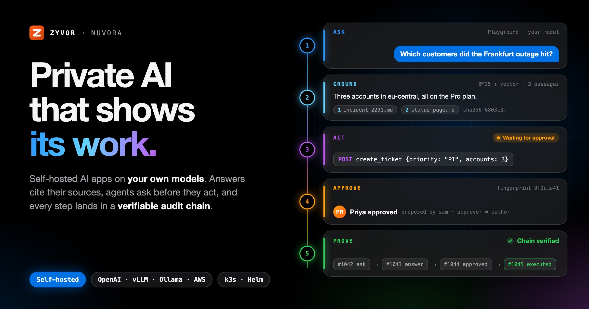

</div>

| **Your data stays home.** | **Any model, your terms.** | **Nothing acts alone.** | **Proof, not promises.** |
|---|---|---|---|
| Prompts, documents and answers stay on infrastructure you run, and an exact host allow-list decides where any request may go. | vLLM, Ollama or any OpenAI-compatible endpoint. Switch models without rewriting the app, and see every token against a budget. | Anything that writes, sends or spends waits for a different person to approve the exact action. | Runs, guardrail decisions and approvals land in a hash-chained audit log you can export and check offline. |

---

## Everything you need to put AI in production. In one platform you control.

### Model choice: use the best model for each job, on your endpoints

Connect the models you already run and pick per task. Discover models automatically, set prices, and let routers start small and escalate only when an answer looks weak.

- vLLM, Ollama, any OpenAI-compatible endpoint, or AWS-hosted models
- Fabric and Gryvia presets with model discovery
- An exact host allow-list: nothing reaches a host that is not on it

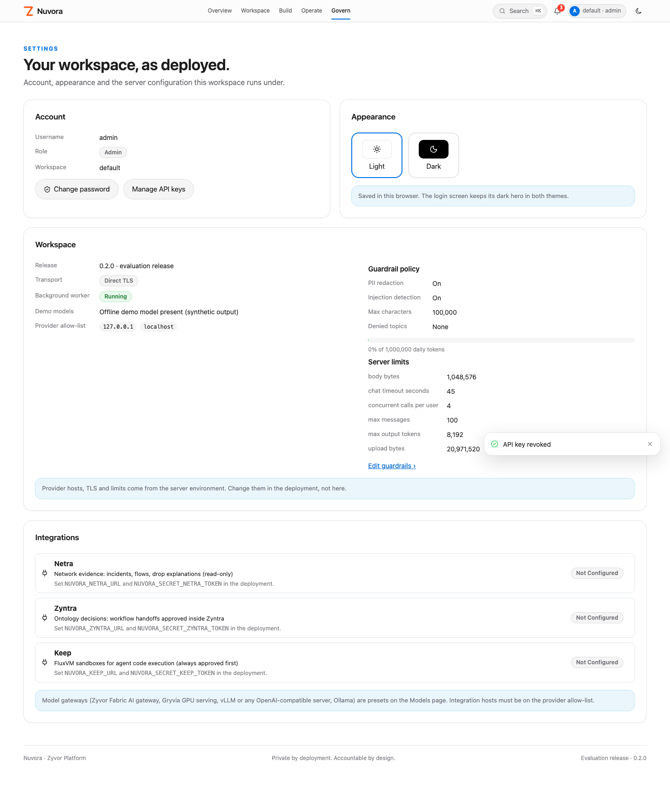

### Your data: AI that knows your business, and who may see what

Upload documents or sync them from your systems. Hybrid retrieval returns the passages behind every answer, filtered by the groups each person belongs to.

- Web, S3 and Confluence connectors with incremental sync
- OCR for scans, audio transcription, typed extraction with review
- Fine-tuning and distillation jobs sent to a trainer you run

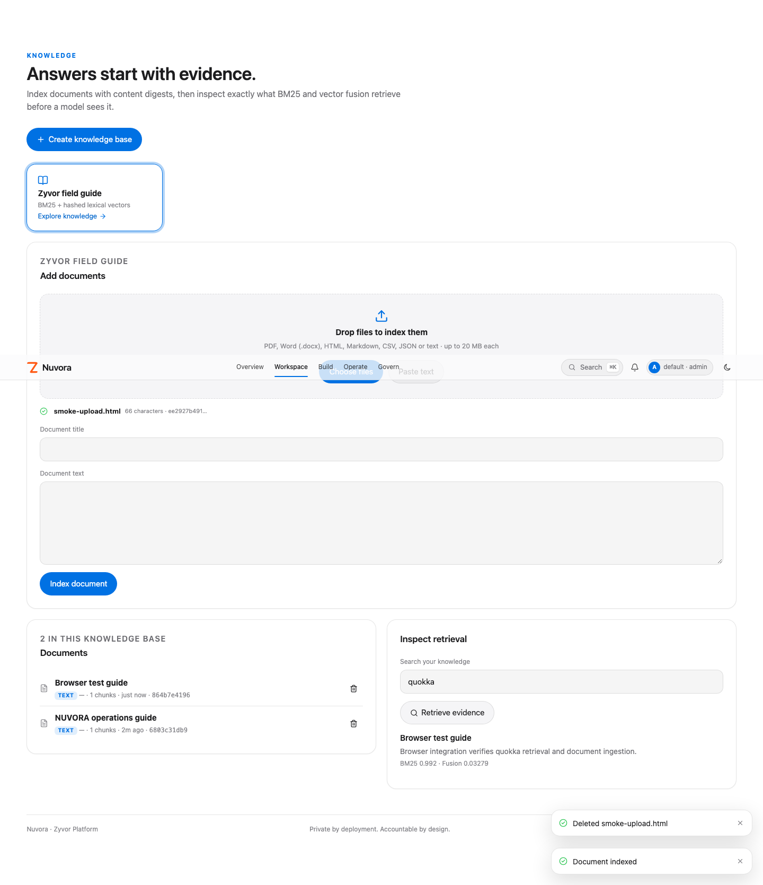

### Agents and workflows: agents that do real work, inside the lines

Give agents a closed set of tools: your OpenAPI actions, MCP servers and suite integrations. Chain steps in a visual builder with branches, reviews and handoffs.

- OpenAPI import and remote MCP servers, registered by an admin
- Session and long-term memory, with writes behind approval
- Workflow steps for retrieval, extraction, images and Zyntra handoff

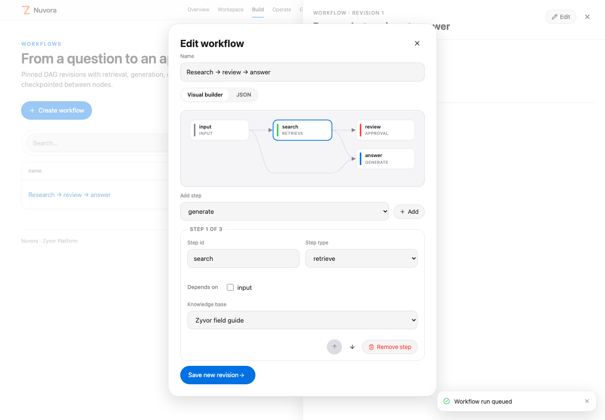

### Safety and guardrails: one policy, applied to every input, output and tool call

Write guardrails once and they screen prompts, answers and tool arguments alike. When a classifier is unsure or unavailable, the request is blocked, not waved through.

- Word and regex filters, PII detection with checksum validation
- Grounding checks that score answers against retrieved sources
- Exact-action approvals: different person, fingerprint, one-hour expiry

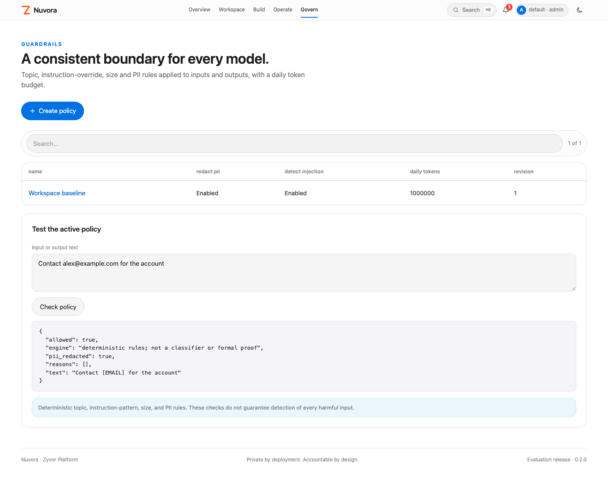

### Cost control: spend where it matters, and see every token

Cascade routers try the cheapest capable model first. Caching, batch jobs and per-workspace budgets keep costs predictable, and the ledger shows what each run cost.

- Cascade routers that escalate on weak or unsure answers
- Prompt cache, with provider cached-token pricing tracked separately
- Token budgets, concurrency caps and batch requests

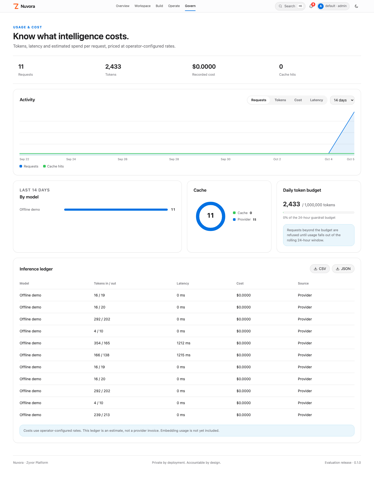

### Evaluate and prove: know it works before you ship. Prove it after

Evaluation suites score grounding and judge criteria per case, and prompt experiments compare variants on the same suite. Every run is traced and every decision recorded.

- Assertions, LLM-judge and grounded cases, with reasons
- Run waterfall with per-step timing and OpenTelemetry export
- Hash-chained audit log, exportable and verifiable offline

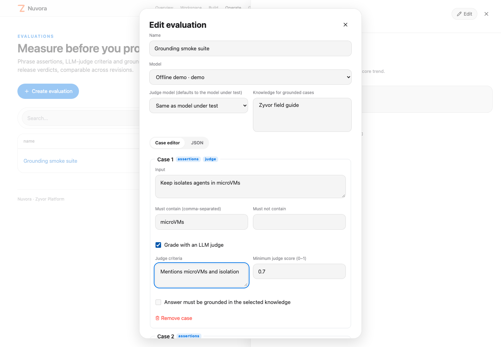

---

## Take agents to production with full control

Every step an agent takes is bounded, screened and on the record. The moment it wants to change something real, a person signs off on the exact action first.

**Plan → Call a tool → Policy check → Approve → Act → Record**

- A closed tool registry and a fixed step limit. No shell, no open internet.
- Code runs in a Keep sandbox with no network, only after a different person approves the exact code.
- Durable jobs survive restarts. Work interrupted by a failed worker is flagged for review, not lost.
- Every step timed in a run waterfall, exportable to your tracing stack.

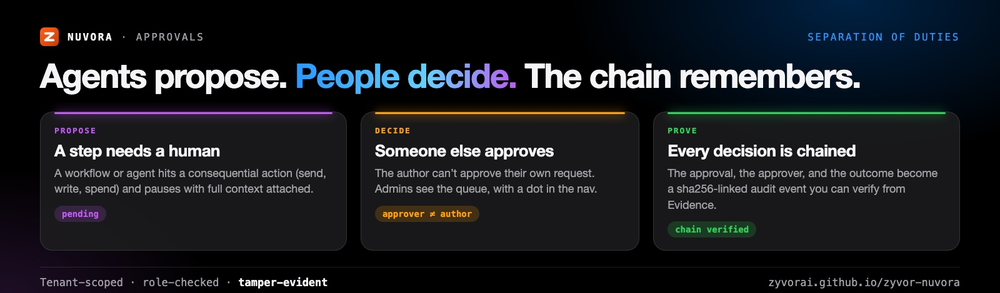

## From idea to production, fast

| | |
|---|---|
| **Ask your documents.** Answers grounded in your policies, contracts and runbooks, with the source passage a click away. | **Assistants that act.** Open the ticket, issue the refund, update the record, after the right person approves. |
| **Turn documents into data.** Extract typed fields from forms and scans. Low-confidence results wait for a reviewer. | **Images and audio.** Read scans with OCR, transcribe calls, reason over images in chat, and generate images. |
| **Automate workflows.** Chain retrieval, models, reviews and handoffs into flows that pause wherever a human should decide. | **Explain incidents.** Ask why traffic dropped. Agents read Netra network evidence and cite it in the answer. |

## Everything a hosted AI platform does for you. On ground you own.

| | Typical hosted AI platform | Nuvora |
|---|---|---|
| Where it runs | The provider's cloud regions | Your hardware, your cloud account, or fully air-gapped |
| Where prompts go | To the provider's service | Only to hosts on an exact allow-list you control |
| Who approves an agent's action | Whatever confirmation steps you configure | A different person, on the exact action, every time |
| What you can prove | Logs in the provider's monitoring service | A hash-chained audit log you export and verify offline |
| Where agent code runs | A managed runtime in the provider's cloud | A sandbox with no network, after approval |
| How model spend works | Metered by the provider | Your endpoints, with a ledger and budgets per workspace |

Hosted platforms bring managed model catalogs and regional compliance programs. Nuvora brings control.

The [capability map](docs/COMPARISON.md) lists what's included and what isn't. It's a design map, not a benchmark.

**[Book a demo](https://zyvor.dev/schedule?utm_source=github&utm_medium=nuvora&utm_campaign=readme_compare)** · **[Start a 30-day PoC](https://zyvor.dev/poc?utm_source=github&utm_medium=nuvora&utm_campaign=readme_compare)**

---

## Release status

> **0.3.0 is an evaluation release, not a production certification.**
> - Model calls work against configured OpenAI-compatible or Ollama endpoints. The optional AWS adapter (boto3, Converse and streaming) has no tool calling and hasn't been validated against a live account.
> - The bundled offline model is synthetic.
> - Guardrails v2, routers, MCP tools, connectors, OCR, training and images are new in 0.3.0. They're tested against stubs and the offline model, not against every provider, trainer or source system.
> - Nuvora calls your trainer and your image model. It doesn't host GPUs or models. Multi-region HA isn't implemented.
>
> Check the [capability matrix](docs/CAPABILITIES.md) before relying on any feature. What changed: [CHANGELOG.md](CHANGELOG.md).

## Quickstart

The API and the included compiled console need only Python **3.11+**. The offline demo doesn't need a GPU, a cluster, `pip install`, or a hosted model.

```bash
git clone https://github.com/zyvorai/zyvor-nuvora.git && cd zyvor-nuvora
export NUVORA_ADMIN_PASSWORD='choose-your-own-strong-password'
python3 -m nuvora.server --demo
```

Open **http://127.0.0.1:8789** and sign in as `admin` in workspace `default`, with the password from your environment. The first start creates the administrator, and changing the variable later doesn't reset it. There's no built-in default password.

The demo seeds synthetic chat and image models, a knowledge base, an investigator agent, an approval workflow, a prompt, an evaluation suite and an external-training recipe. Then:

1. In **Playground**, choose *Zyvor field guide* and ask about Keep. Inspect the cited passages and content digests. The response is labeled **OFFLINE DEMO**.
2. In **Agents**, queue a run of the investigator and inspect its tool trace in **Runs**.
3. In **Workflows**, start *Research → review → answer* and open its waiting approval.
4. In **Access**, add a second person with the `approver` role. Sign in as them and approve the exact action.
5. The worker resumes the pinned workflow revision. Export the run evidence.

## Connect a real model

```bash
export NUVORA_PROVIDER_HOSTS='localhost,127.0.0.1,inference.internal.example'
export NUVORA_SECRET_VLLM='your-provider-key'
python3 -m nuvora.server
```

In **Models**, create an `openai` provider with the base URL of your OpenAI-compatible endpoint (vLLM, llama.cpp, Fabric or Gryvia).
- Loopback HTTP is accepted. Remote hosts need HTTPS and must be on the exact allow-list.
- Credentials reference a `NUVORA_SECRET_*` environment variable and are never saved in model objects.
- `auto` picks the lowest configured price among enabled real chat providers, falling back to the demo only when none exists. For quality-aware escalation, create a router and use `router:<id>`.
- For Ollama, choose `ollama` with `http://127.0.0.1:11434`. For tool-using agents on Ollama, use its OpenAI-compatible `/v1` endpoint with provider `openai`.
- Optional AWS: `python3 -m pip install '.[aws]'`, then create an `aws` model with a region and an enabled model or inference-profile id. boto3 uses the standard credential chain.

## API

Chat, streaming and image endpoints speak the OpenAI wire format, so existing clients point at Nuvora unchanged:

```bash
curl https://nuvora.example.com/v1/chat/completions \
  -H "Authorization: Bearer $NUVORA_TOKEN" \
  -H "Content-Type: application/json" \
  -d '{"model": "auto", "messages": [{"role": "user", "content": "Summarize the refund policy"}]}'
```

Use a scoped service token. Every request passes guardrails, routing, budgets and the audit chain. Full reference: [docs/API.md](docs/API.md). A dependency-free Python client lives in [sdk/python](sdk/python).

## Deploy to k3s

```bash
./scripts/deploy-remote.sh 10.0.1.5 ubuntu      # HOST USER, or user@host
```

The script rsyncs the tree, builds with podman on the host, imports the image into k3s and runs `helm upgrade --install` with a persistent TLS secret.
- **URL:** `https://HOST:30789`, with a self-signed certificate that persists across redeploys.
- **Sign in:** `admin`, with the password generated and printed on first deploy. Set `NUVORA_ADMIN_PASSWORD` to choose one, or `NUVORA_DEMO_PASSWORD=1` for the lab login `Admin@321`.
- **Flags:** `--quick` skips the image build, `--verify-only` checks health without changes, `--dry-run` shows the plan.

SQLite on one node, PostgreSQL across replicas. Environment variables include `NUVORA_NODE_PORT`, `NUVORA_PROVIDER_HOSTS` and `NUVORA_DEMO=0`. Docker, Compose and the Helm chart live in [deploy/](deploy). See [docs/deploy.md](docs/deploy.md).

## What is included

| Area | Runnable behavior |
|---|---|
| Models | Catalog, explicit or price-based selection, cascade routers, OpenAI/Ollama adapters, optional AWS adapter, image models, trainer-backed LoRA/QLoRA/distillation |
| Knowledge | File upload (txt/md/json/csv/html/docx, PDF via extra), OCR and audio transcription, web/S3/Confluence connectors, metadata filters, group ACLs, BM25 + lexical-vector fusion, OpenAI/Ollama embeddings, optional LLM rerank |
| Agents | Bounded model/tool loop, registered tool schemas, OpenAPI-imported actions, MCP server tools, Netra evidence tools, Keep `run_code` behind approval, long-term memory, OTLP step traces |
| Workflows | Ordered DAG validation, retrieve/generate/template/condition/extract/review/handoff/generate_image nodes, durable checkpoints, Zyntra handoff |
| Prompts and evaluation | Version snapshots, weighted variants, experiments on evaluation suites; contains/excludes, LLM-judge and grounded cases with reasons and release verdicts |
| Governance | OIDC SSO, tenant isolation, viewer/developer/approver/admin roles, scoped and revocable service tokens, separate-human approvals |
| Guardrails | Word and regex filters, PII masking or blocking (email, IBAN, card, SSN, IPv4, phone), grounding score, classifier model, size limits |
| Inference operations | Guardrail-checked streaming in the console and on `/v1`, deterministic cache, batch jobs, token budgets, concurrency caps |
| Evidence | Job traces, source digests, hash-chained audit with filters, CSV and JSON exports, offline chain verification |
| Delivery | SQLite or PostgreSQL, compiled console, Python SDK/CLI, Docker/Compose, images on ghcr.io, Helm chart with replicas, k3s deploy script |

## More of the console

| | |
|---|---|
| 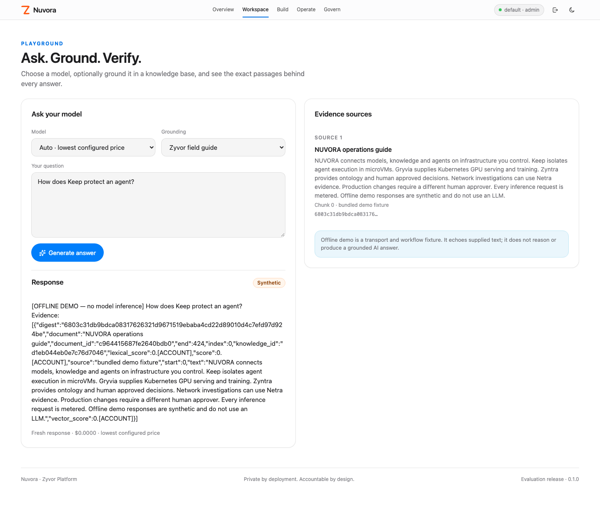 | 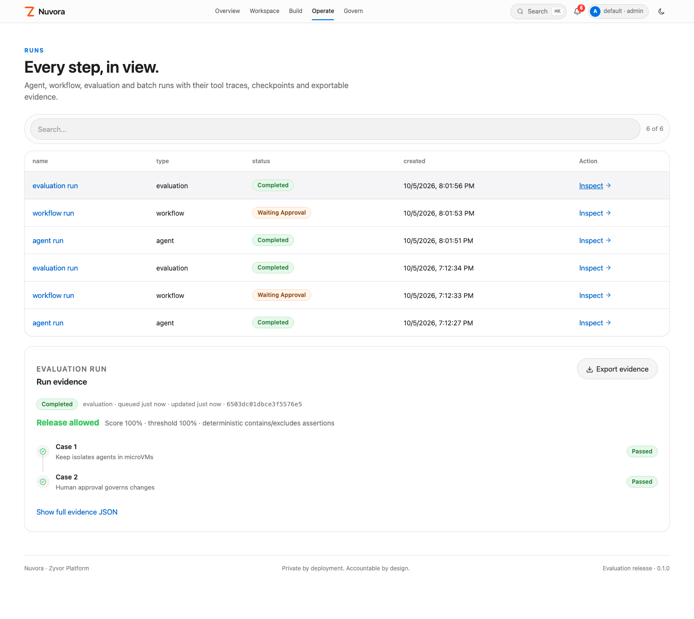 |
| **Playground.** Streaming, model compare and cited passages. | **Runs.** Every step, in view. |
| 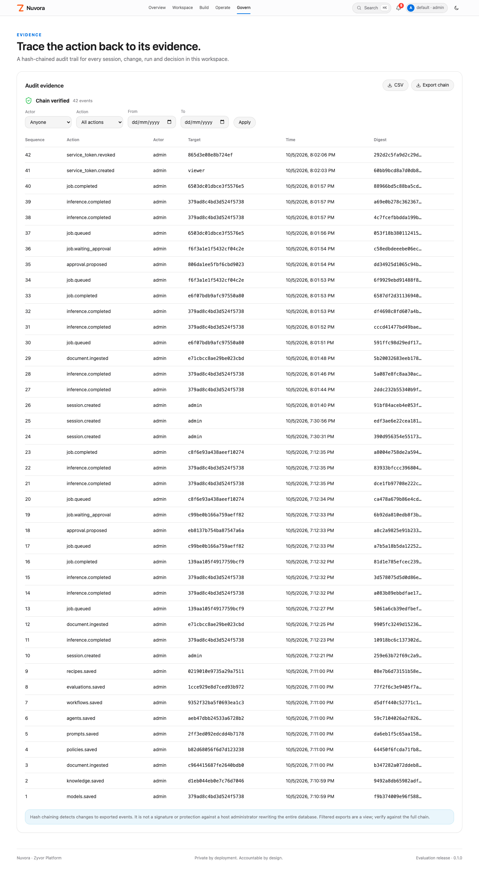 | 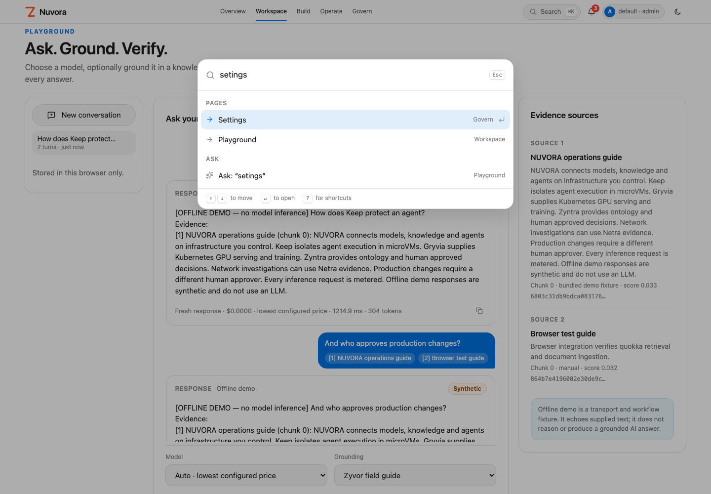 |
| **Evidence.** A verifiable hash chain. | **⌘K.** Jump to any page, resource or action. |
| 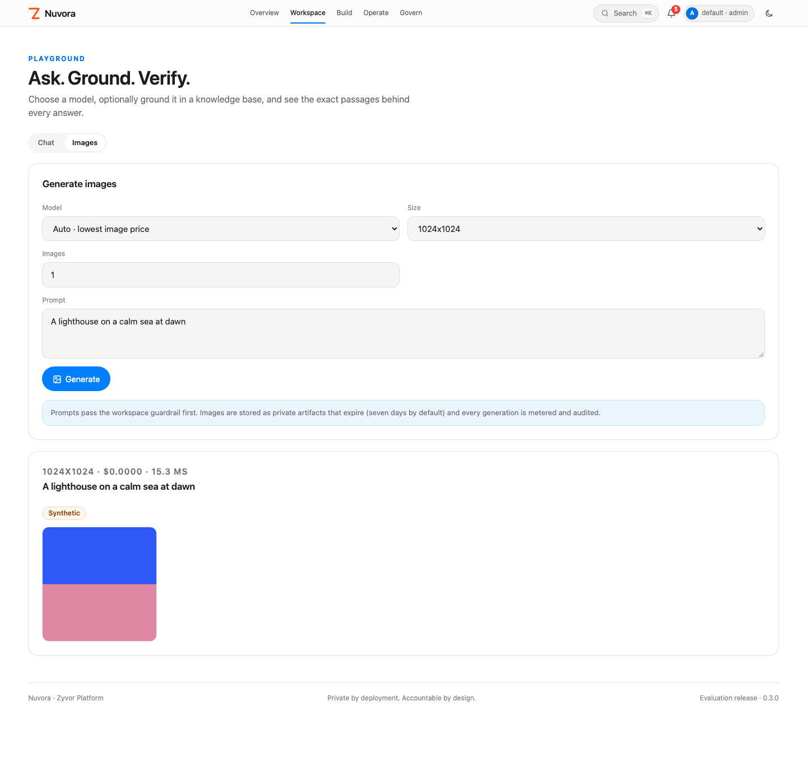 | 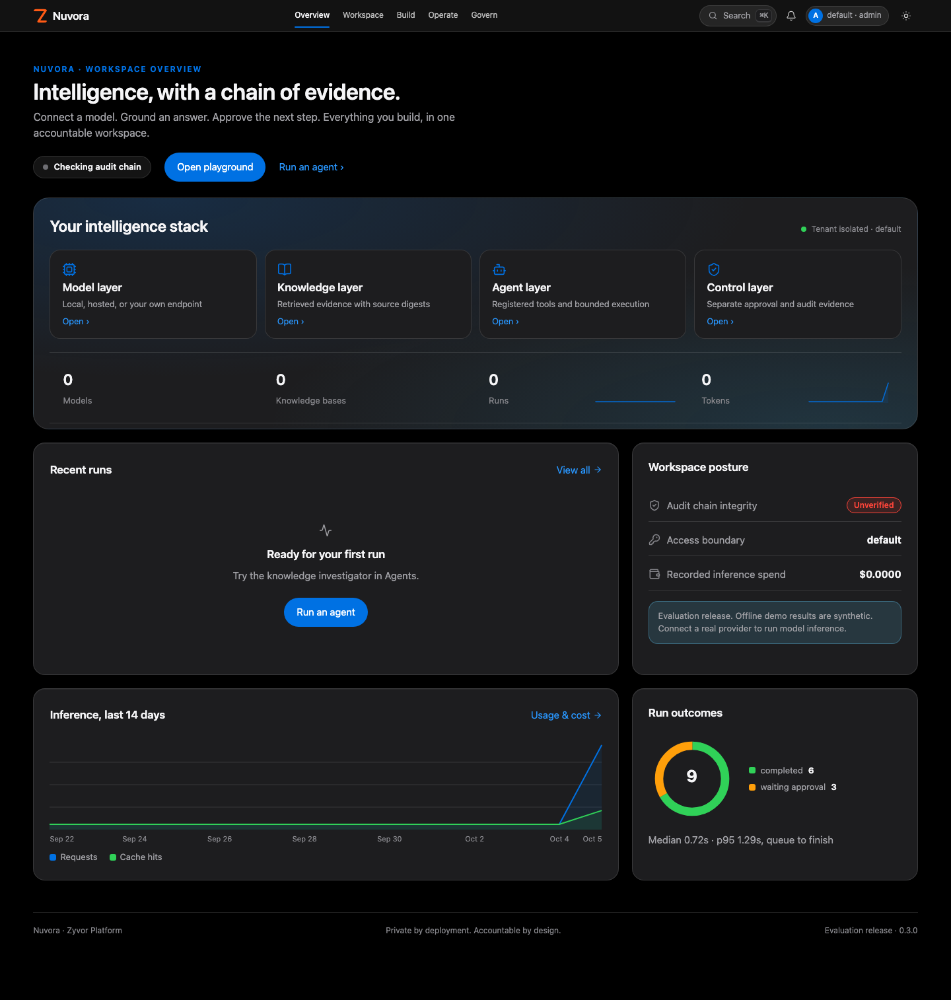 |
| **Images.** Metered, guardrailed and expiring. | **Dark mode.** One click, remembered on this device. |

## Where Nuvora fits in the Zyvor suite

Nuvora is the application workspace above Fabric, Gryvia, Aurora and Zyntra. It connects to their model endpoints through its OpenAI-compatible adapter, calls Netra for evidence, hands decisions to Zyntra, and runs code in Keep, all behind operator configuration. It doesn't duplicate their VM execution or Kubernetes scheduling engines.

## Develop and test

```bash
make check                        # backend tests, console tests, console build
```

The console uses React, TypeScript, Vite and lucide-react on the [Zyvor Apple UX contract](docs/design/APPLE-UX-CONTRACT.md). For the browser smoke test against a running instance:

```bash
npm install --no-save --package-lock=false playwright && npx playwright install chromium --only-shell
NUVORA_TEST_URL=https://HOST:30789 NUVORA_TEST_PASSWORD='YOUR_ADMIN_PASSWORD' node scripts/browser-smoke.cjs
```

It signs in, exercises every page and the evaluate-to-runs flow, verifies the evidence chain, and checks light and dark at 1440px and 390px. README artwork is rendered from HTML with `./docs/social/build.sh` (see [docs/social](docs/social/README.md)).

```text
nuvora/             HTTP API, platform services, storage (SQLite/Postgres), auth, SSO, providers, retrieval, integrations
nuvora/static/      Prebuilt console; included so the Python-only quickstart works
web/                React/TypeScript console
website/            Docusaurus docs site (GitHub Pages)
sdk/python/         Dependency-free client
scripts/            deploy-remote.sh, deploy guards, browser smoke, evidence verifier
tests/              Backend, HTTP, provider and boundary tests
deploy/             Dockerfile, Compose, Helm chart
docs/               Architecture, API, operations, deploy, UX contract, screenshots, social art
```

## Documentation

[Docs site](https://zyvorai.github.io/zyvor-nuvora/) · [Capabilities](docs/CAPABILITIES.md) · [Capability map](docs/COMPARISON.md) · [Architecture](docs/ARCHITECTURE.md) · [API](docs/API.md) · [Operations](docs/OPERATIONS.md) · [Deploy](docs/deploy.md) · [Roadmap](docs/ROADMAP.md) · [Changelog](CHANGELOG.md)

## Security and contributing

Report vulnerabilities as described in [SECURITY.md](SECURITY.md). The security model is documented at [zyvorai.github.io/zyvor-nuvora/docs/security](https://zyvorai.github.io/zyvor-nuvora/docs/security). To contribute, see [CONTRIBUTING.md](CONTRIBUTING.md).

## License

Nuvora is source-available under the **[Zyvor Production License v1.0](LICENSE)** (SPDX `LicenseRef-Zyvor-Production-1.0`, also in [LICENSES/](LICENSES/LicenseRef-Zyvor-Production-1.0.txt)).

- **Free** for evaluation, development, testing, research, education, non-production labs and all other non-production use.
- **Production use** requires a separate paid commercial license from Zyvor AI Labs. Plans and terms: [Pricing](https://zyvor.dev/pricing?utm_source=github&utm_medium=nuvora&utm_campaign=readme_license) · [sales@zyvor.dev](mailto:sales@zyvor.dev).

Third-party dependencies keep their own licenses; see [THIRD-PARTY.md](THIRD-PARTY.md).
